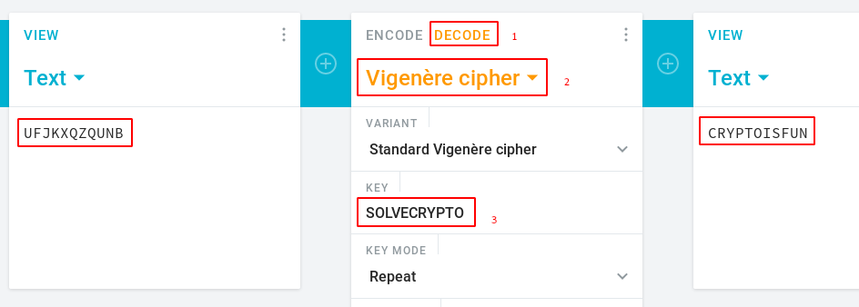

# Easy1
## Question
>The one time pad can be cryptographically secure, but not when you know the key. Can you solve this? We've given you the encrypted flag, key, and a table to help `UFJKXQZQUNB` with the key of `SOLVECRYPTO`. Can you use this [table](files/table.txt) to solve it?. 

## Hint
>Submit your answer in our competition's flag format. For example, if you answer was `hello`, you would submit `picoCTF{HELLO}` as the flag.

>Please use all caps for the message.

# Solution
The table is the one from the [Vigenere cipher](https://en.wikipedia.org/wiki/Vigen%C3%A8re_cipher). To decrypt the message, go to https://cryptii.com/ and do as follows:

# Flag
`picoCTF{CRYPTOISFUN}`
