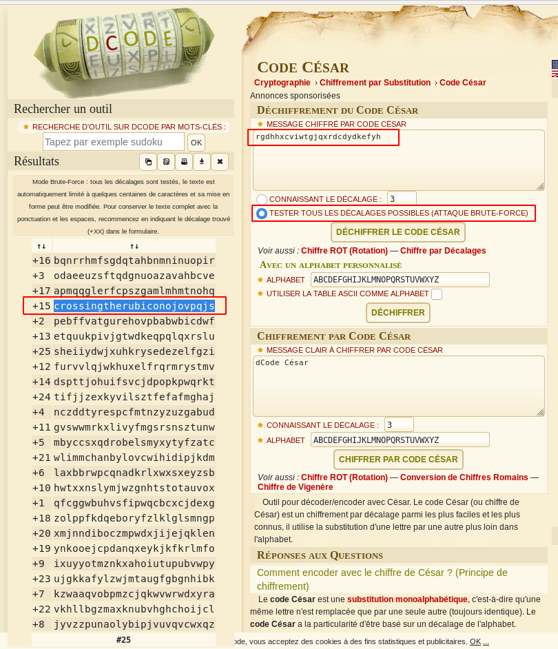

# caesar
## Question
>Decrypt this [message](files/ciphertext). You can find the ciphertext in `/problems/caesar_6_238b8f4604d91ecb59cda5b4f0e66fc8` on the shell server.

## Hint
>caesar cipher [tutorial](https://learncryptography.com/classical-encryption/caesar-cipher)

# Solution
Brute force the Caesar cipher (unknown offset) with https://www.dcode.fr/chiffre-cesar. Decoded message found with an offset of 15:

# Flag
`picoCTF{crossingtherubiconojovpqjs}`
