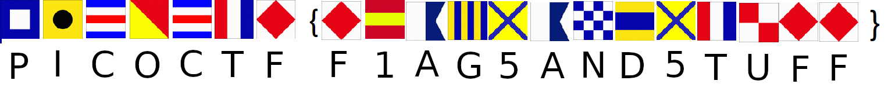

# Flags
## Question
>What do the [flags](files/flag.png) mean?

## Hint
>The flag is in the format `PICOCTF{}`

# Solution
Refer to the Wikipedia page of the maritime flags: https://en.wikipedia.org/wiki/International_maritime_signal_flags

# Flag
`PICOCTF{F1AG5AND5TUFF}`
