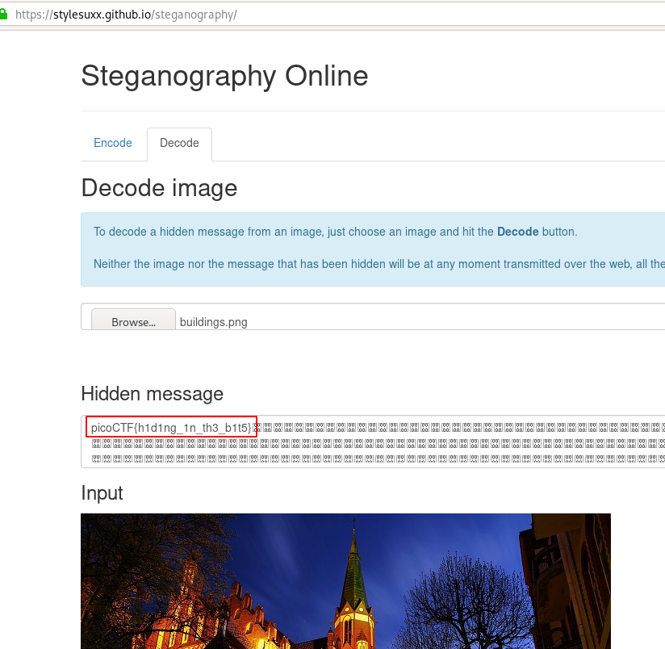

# What Lies Within
## Question
>Theres something in the [building](files/buildings.png). Can you retrieve the flag?

## Hint
>There is data encoded somewhere, there might be an online decoder

# Solution
Upload the picture to https://stylesuxx.github.io/steganography/.

# Flag
`picoCTF{h1d1ng_1n_th3_b1t5}`
