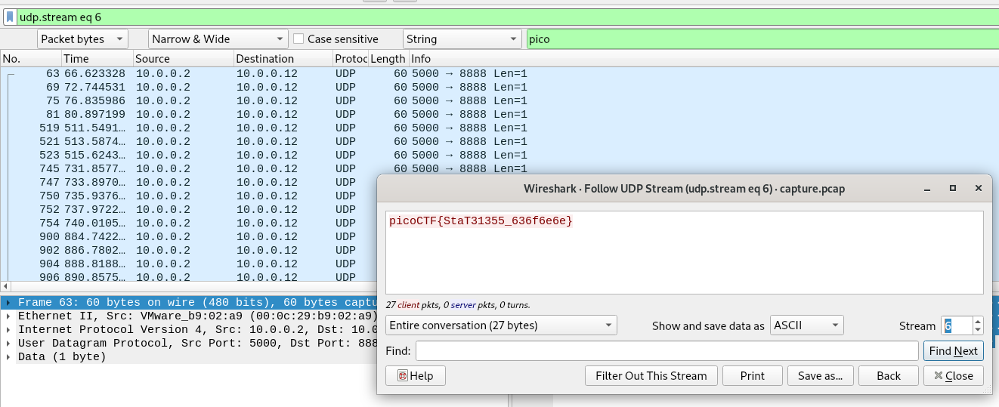

# shark on wire 1
## Question
>We found this [packet capture](files/capture.pcap). Recover the flag. You can also find the file in `/problems/shark-on-wire-1_0_13d709ec13952807e477ba1b5404e620`.

## Hint
>Try using a tool like Wireshark

>What are streams?

# Solution
Open the capture in Wireshark. You can use search (Ctrl+F) to search for strings (select search `String` in `Packet bytes`):

Then right click > follow > UDP stream:

Use the arrow on the bottom right side of the window to navigate from one stream to another one. The flag was just found in the next stream:

# Flag
`picoCTF{StaT31355_636f6e6e}`
