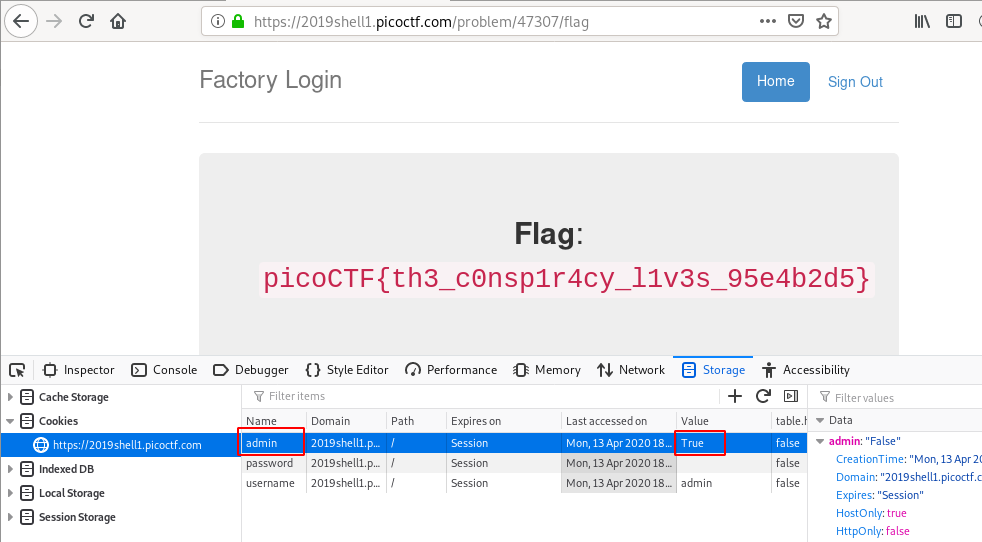

# logon
## Question
>The factory is hiding things from all of its users. Can you login as logon and find what they've been looking at? `https://2019shell1.picoctf.com/problem/47307/` ([link](https://2019shell1.picoctf.com/problem/47307/)) or `http://2019shell1.picoctf.com:47307`

## Hint
>Hmm it doesn't seem to check anyone's password, except for `{{name}}`'s?

# Solution
Open the website in your browser and enter `admin` in the `username` field. Put whatever you want in the `password` field, and click on `Sign In`. You will be redirected to `/flag`, and the following message will be displayed: `Success: You logged in! Not sure you'll be able to see the flag though`.

Now, fire up the web developper bar (`Ctrl` + `Shift` + `I`) and display the cookies. You will notice that there is a cookie named `admin` set to `False`. Set it to `True` and refresh the page (`F5`). Now, the flag will be displayed.

 

# Flag
`picoCTF{th3_c0nsp1r4cy_l1v3s_95e4b2d5}`
