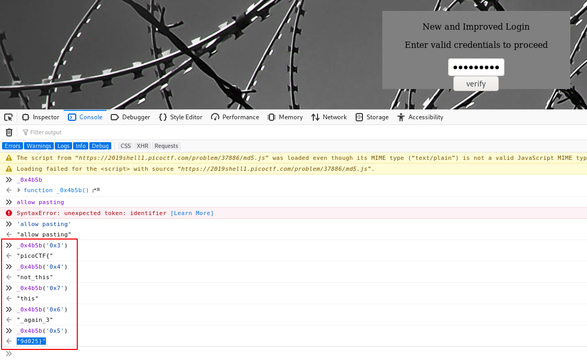

# Client-side-again
## Question
>Can you break into this super secure portal? `https://2019shell1.picoctf.com/problem/37886/` ([link](https://2019shell1.picoctf.com/problem/37886/)) or `http://2019shell1.picoctf.com:37886`

## Hint
>What is obfuscation?

# Solution
In the source code of the page, you can copy the javascript function that checks the password, and paste it to an online JS beautifer/deobfuscator (e.g. https://lelinhtinh.github.io/de4js/). Here is what you obtain:

```javascript
var _0x5a46 = ['9d025}', '_again_3', 'this', 'Password Verified', 'Incorrect password', 'getElementById', 'value', 'substring', 'picoCTF{', 'not_this'];
(function (_0x4bd822, _0x2bd6f7) {
    var _0xb4bdb3 = function (_0x1d68f6) {
        while (--_0x1d68f6) {
            _0x4bd822['push'](_0x4bd822['shift']());
        }
    };
    _0xb4bdb3(++_0x2bd6f7);
}(_0x5a46, 0x1b3));
var _0x4b5b = function (_0x2d8f05, _0x4b81bb) {
    _0x2d8f05 = _0x2d8f05 - 0x0;
    var _0x4d74cb = _0x5a46[_0x2d8f05];
    return _0x4d74cb;
};

function verify() {
    checkpass = document[_0x4b5b('0x0')]('pass')[_0x4b5b('0x1')];
    split = 0x4;
    if (checkpass[_0x4b5b('0x2')](0x0, split * 0x2) == _0x4b5b('0x3')) {
        if (checkpass[_0x4b5b('0x2')](0x7, 0x9) == '{n') {
            if (checkpass[_0x4b5b('0x2')](split * 0x2, split * 0x2 * 0x2) == _0x4b5b('0x4')) {
                if (checkpass[_0x4b5b('0x2')](0x3, 0x6) == 'oCT') {
                    if (checkpass[_0x4b5b('0x2')](split * 0x3 * 0x2, split * 0x4 * 0x2) == _0x4b5b('0x5')) {
                        if (checkpass['substring'](0x6, 0xb) == 'F{not') {
                            if (checkpass[_0x4b5b('0x2')](split * 0x2 * 0x2, split * 0x3 * 0x2) == _0x4b5b('0x6')) {
                                if (checkpass[_0x4b5b('0x2')](0xc, 0x10) == _0x4b5b('0x7')) {
                                    alert(_0x4b5b('0x8'));
                                }
                            }
                        }
                    }
                }
            }
        }
    } else {
        alert(_0x4b5b('0x9'));
    }
}
```

Now, there is some more work to do manually on the `verify` function. Make the necessary replacements using the console Web developer console:



Once you have simplified the code, notice that the substrings are overlapping:
~~~~ 
                           +----+----+----+----+----+----+----+----+----+----+----+----+----+----+----+----+----+----+----+----+----+----+----+----+----+----+----+----+----+
                           | 00 | 01 | 02 | 03 | 04 | 05 | 06 | 07 | 08 | 09 | 10 | 11 | 12 | 13 | 14 | 15 | 16 | 17 | 18 | 19 | 20 | 21 | 22 | 23 | 24 | 25 | 26 | 27 | 28 |
                           +----+----+----+----+----+----+----+----+----+----+----+----+----+----+----+----+----+----+----+----+----+----+----+----+----+----+----+----+----+
flag(0, 8) == "picoCTF{"   | p  | i  | c  | o  | C  | T  | F  | {  |    |    |    |    |    |    |    |    |    |    |    |    |    |    |    |    |    |    |    |    |    |
flag(3, 6) == "oCT"        |    |    |    | o  | C  | T  |    |    |    |    |    |    |    |    |    |    |    |    |    |    |    |    |    |    |    |    |    |    |    |
flag(6, 11) == "F{not"     |    |    |    |    |    |    | F  | {  | n  | o  | t  |    |    |    |    |    |    |    |    |    |    |    |    |    |    |    |    |    |    |
flag(7, 9) == "{n"         |    |    |    |    |    |    |    | {  | n  |    |    |    |    |    |    |    |    |    |    |    |    |    |    |    |    |    |    |    |    |
flag(8, 16) == "not_this"  |    |    |    |    |    |    |    |    | n  | o  | t  | _  | t  | h  | i  | s  |    |    |    |    |    |    |    |    |    |    |    |    |    |
flag(12, 16) == "this"     |    |    |    |    |    |    |    |    |    |    |    |    | t  | h  | i  | s  |    |    |    |    |    |    |    |    |    |    |    |    |    |
flag(16, 24) == "_again_3" |    |    |    |    |    |    |    |    |    |    |    |    |    |    |    |    | _  | a  | g  | a  | i  | n  | _  | 3  |    |    |    |    |    |
flag(24, 32) == "9d025}"   |    |    |    |    |    |    |    |    |    |    |    |    |    |    |    |    |    |    |    |    |    |    |    |    | 9  | d  | 0  | 2  | 5  |
                           +----+----+----+----+----+----+----+----+----+----+----+----+----+----+----+----+----+----+----+----+----+----+----+----+----+----+----+----+----+
                           | p  | i  | c  | o  | C  | T  | F  | {  | n  | o  | t  | _  | t  | h  | i  | s  | _  | a  | g  | a  | i  | n  | _  | 3  | 9  | d  | 0  | 2  | 5  |
                           +----+----+----+----+----+----+----+----+----+----+----+----+----+----+----+----+----+----+----+----+----+----+----+----+----+----+----+----+----+
~~~~

# Flag
`picoCTF{not_this_again_39d025}`
