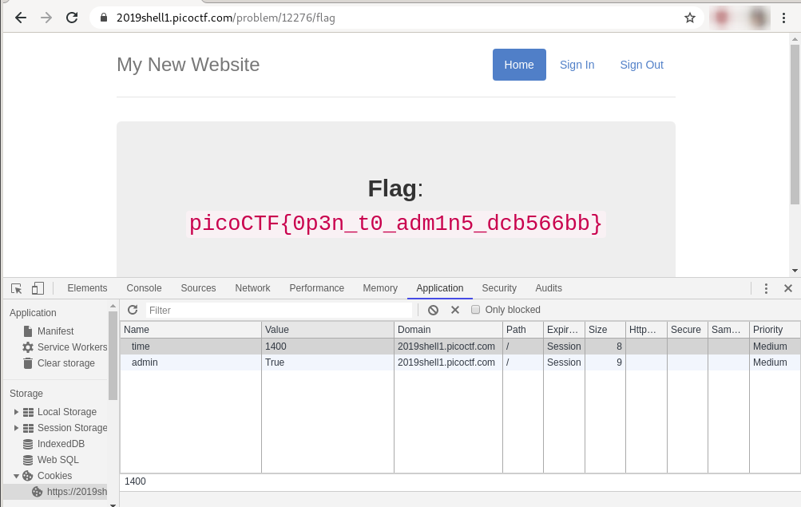

# Open-to-admins
## Question
>This secure website allows users to access the flag only if they are **admin** and if the **time** is exactly `1400`. `https://2019shell1.picoctf.com/problem/12276/` ([link](https://2019shell1.picoctf.com/problem/12276/)) or `http://2019shell1.picoctf.com:12276`

## Hint
>Can cookies help you to get the flag?

# Solution
Connect to https://2019shell1.picoctf.com/problem/12276/ using Google Chrome (I recommend Chrome for this challenge) and click on the `Flag` button.

Fire up the web developer bar (`Ctrl`+`Shift`+`I`) and navigate to Application > Storage > Cookies. Add these 2 cookies:

| Name | Value |
|---|---|
| admin | True |
| time | 1400 |

Refresh the page and you will get the flag.

# Flag
`picoCTF{0p3n_t0_adm1n5_dcb566bb}`
